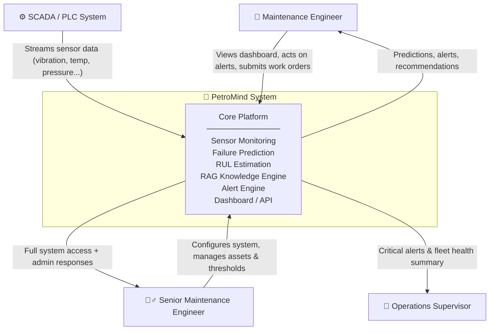
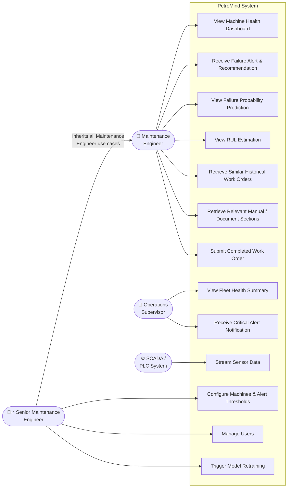
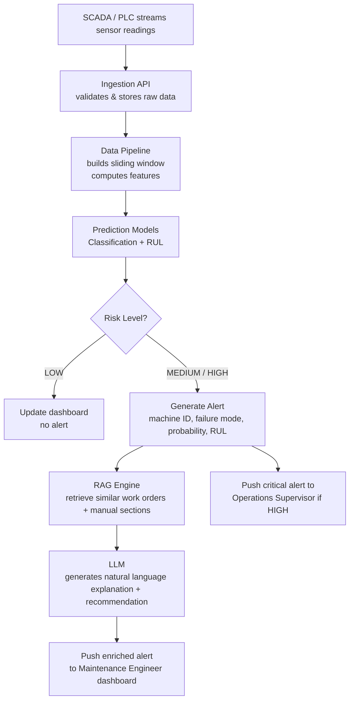
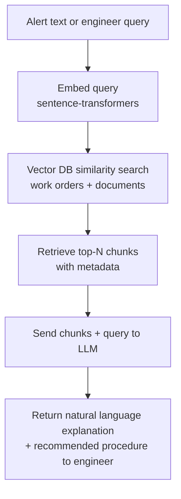
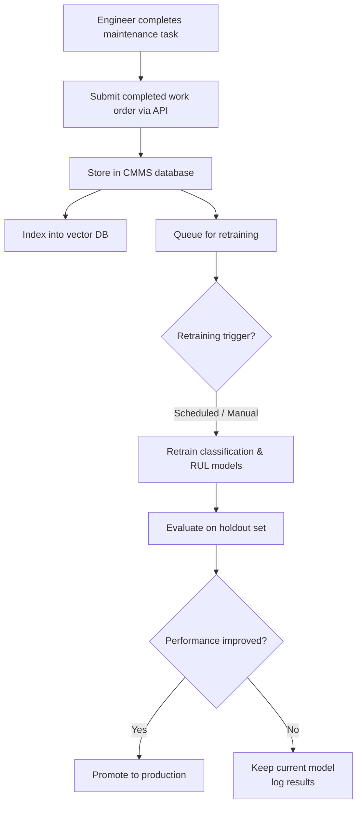
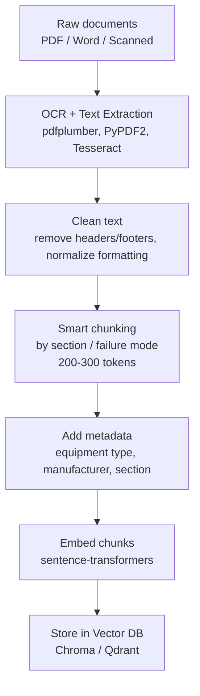

# PetroMind — System Analysis Document
### Predictive Maintenance & AI Knowledge Integration System
**Version:** 1.0  
**Date:** March 2026  
**Prepared by:** PetroMind Engineering Team

---

## Table of Contents

1. [Project Overview](#1-project-overview)
2. [Problem Statement](#2-problem-statement)
3. [Actors](#3-actors)
4. [System Context Diagram](#4-system-context-diagram)
5. [Use Case Diagram](#5-use-case-diagram)
6. [Use Case Descriptions](#6-use-case-descriptions)
7. [User Stories](#7-user-stories)
8. [Acceptance Criteria](#8-acceptance-criteria)
9. [Functional Requirements](#9-functional-requirements)
10. [Non-Functional Requirements](#10-non-functional-requirements)
11. [System Components](#11-system-components)
12. [Data Description](#12-data-description)
13. [System Flow](#13-system-flow)
14. [Error Handling & Edge Cases](#14-error-handling--edge-cases)
15. [Assumptions & Constraints](#15-assumptions--constraints)


---

## 1. Project Overview

**PetroMind** is an end-to-end industrial predictive maintenance and knowledge integration system. It continuously monitors sensor data from industrial machines (vibration, temperature, pressure, current, flow), predicts failure risk and Remaining Useful Life (RUL), and enriches its output with a Retrieval-Augmented Generation (RAG) knowledge layer that retrieves relevant historical work orders, equipment manuals, and technical documents.

**Who uses it:**
- Maintenance engineers who respond to machine alerts and need actionable recommendations
- Senior maintenance engineers who configure the system and manage assets
- Operations supervisors who need a high-level view of fleet health

**What problem it solves:**  
It replaces reactive, unplanned maintenance with data-driven, proactive decision-making — reducing downtime, enabling smarter scheduling, and surfacing relevant institutional knowledge at the moment it is needed.

---

## 2. Problem Statement

> The problem is that industrial facilities currently rely on reactive or schedule-based maintenance, which leads to unplanned machine downtime, excessive maintenance costs, and loss of operational knowledge. Maintenance engineers lack a unified system that combines real-time sensor monitoring, intelligent failure prediction, and instant access to historical fixes and technical documentation — resulting in slow diagnosis, repeated mistakes, and high dependency on individual expertise.

---

## 3. Actors

| Actor | Type | Description |
|---|---|---|
| **Maintenance Engineer** | Human (Primary) | Operates the system daily. Views machine health, acts on alerts, retrieves work orders and manual sections, submits completed maintenance records. |
| **Senior Maintenance Engineer** | Human (Admin) | Has full access to everything the Maintenance Engineer can do, plus system configuration: adding machines, setting alert thresholds, managing users, and triggering manual retraining. |
| **Operations Supervisor** | Human (Secondary) | Receives critical alerts and views fleet-level health summaries. Does not interact with machine-level details directly. |
| **SCADA / PLC System** | External System | Streams raw sensor readings (vibration, temperature, pressure, etc.) into the platform continuously. Acts as the primary data source for real-time monitoring. |

---

## 4. System Context Diagram



---

## 5. Use Case Diagram



> **Note:** Senior Maintenance Engineer inherits all use cases of Maintenance Engineer via the inheritance arrow, in addition to the admin-specific use cases (UC11–UC13).

---

## 6. Use Case Descriptions

### UC1 — View Machine Health Dashboard

| Field | Detail |
|---|---|
| **Actor** | Maintenance Engineer, Senior Maintenance Engineer |
| **Trigger** | Engineer logs into the system or navigates to a machine |
| **Precondition** | Sensor data is being ingested; machine exists in the system |
| **Main Flow** | 1. Engineer selects a machine. 2. System displays machine ID, type, location. 3. System displays live or latest sensor readings and trend plots. 4. System displays current failure probability and RUL estimate. |
| **Outcome** | Engineer has a clear snapshot of machine health status |
| **Alternate Flow** | If sensor data is unavailable, system shows last known values with a staleness warning |

---

### UC2 — Receive Failure Alert & Recommendation

| Field | Detail |
|---|---|
| **Actor** | Maintenance Engineer, Senior Maintenance Engineer |
| **Trigger** | Failure probability exceeds threshold (e.g., > 0.8) OR RUL drops below threshold (e.g., < 48 hours) |
| **Precondition** | Prediction models are running; thresholds are configured |
| **Main Flow** | 1. System detects high-risk condition. 2. System generates alert with machine ID, predicted failure mode, failure probability, and estimated RUL. 3. System calls RAG engine to retrieve top-N similar past work orders and relevant manual sections. 4. Alert is pushed to engineer's dashboard with recommended actions. |
| **Outcome** | Engineer receives a full alert with context — what might fail, when, and what to do about it |
| **Alternate Flow** | If RAG retrieval returns no results, alert is sent without recommendation (system notes "no similar cases found") |

---

### UC3 — View Failure Probability Prediction

| Field | Detail |
|---|---|
| **Actor** | Maintenance Engineer, Senior Maintenance Engineer |
| **Trigger** | Engineer requests prediction for a specific machine |
| **Precondition** | Recent sensor window available for the machine |
| **Main Flow** | 1. Engineer selects machine. 2. System builds latest sensor window. 3. System runs classification model. 4. System returns failure probability for the next T hours (e.g., "Failure probability next 24h: 86%") and risk level (LOW / MEDIUM / HIGH). |
| **Outcome** | Engineer sees quantified risk level with confidence |

---

### UC4 — View RUL Estimation

| Field | Detail |
|---|---|
| **Actor** | Maintenance Engineer, Senior Maintenance Engineer |
| **Trigger** | Engineer requests RUL for a specific machine |
| **Precondition** | Recent sensor window available; RUL model is deployed |
| **Main Flow** | 1. Engineer selects machine. 2. System runs RUL regression model on latest window. 3. System returns estimated remaining useful life in hours or cycles (e.g., "Estimated RUL: 36 hours"). |
| **Outcome** | Engineer can plan maintenance scheduling proactively |

---

### UC5 — Retrieve Similar Historical Work Orders

| Field | Detail |
|---|---|
| **Actor** | Maintenance Engineer, Senior Maintenance Engineer |
| **Trigger** | Alert is generated OR engineer manually searches |
| **Precondition** | Work order vector database is populated |
| **Main Flow** | 1. System converts the current problem description (or alert text) to an embedding. 2. System performs similarity search in the work order vector DB. 3. System returns top-N similar past cases with problem description, action taken, outcome, and date. |
| **Outcome** | Engineer sees what similar problems looked like in the past and what fixed them |

---

### UC6 — Retrieve Relevant Manual / Document Sections

| Field | Detail |
|---|---|
| **Actor** | Maintenance Engineer, Senior Maintenance Engineer |
| **Trigger** | Alert is generated OR engineer manually queries |
| **Precondition** | Document vector database is populated with embedded manual chunks |
| **Main Flow** | 1. System converts anomaly description to embedding. 2. System searches manual/document vector DB. 3. Relevant chunks are retrieved with metadata (equipment type, section, manufacturer). 4. Chunks are sent to LLM to generate a natural language explanation and recommended procedure. |
| **Outcome** | Engineer receives a plain-language explanation of the likely cause with references to official documentation |

---

### UC7 — Submit Completed Work Order

| Field | Detail |
|---|---|
| **Actor** | Maintenance Engineer, Senior Maintenance Engineer |
| **Trigger** | Maintenance task is completed |
| **Precondition** | Work order was generated or exists in CMMS |
| **Main Flow** | 1. Engineer fills in confirmed failure mode, action taken, and actual downtime. 2. System stores the completed record in the CMMS database. 3. Record is queued for next periodic retraining cycle. 4. Record is indexed into the work order vector DB for future retrieval. |
| **Outcome** | System knowledge base grows with each resolved case; models improve over time |

---

### UC8 — View Fleet Health Summary

| Field | Detail |
|---|---|
| **Actor** | Operations Supervisor |
| **Trigger** | Supervisor logs in or requests overview |
| **Precondition** | Multiple machines are being monitored |
| **Main Flow** | 1. Supervisor opens fleet dashboard. 2. System displays all machines with their current risk level (color-coded: LOW / MEDIUM / HIGH). 3. Summary shows total machines, machines at risk, and machines scheduled for maintenance. |
| **Outcome** | Supervisor has a high-level picture of operational risk across the facility |

---

### UC9 — Receive Critical Alert Notification

| Field | Detail |
|---|---|
| **Actor** | Operations Supervisor |
| **Trigger** | A machine reaches HIGH risk level |
| **Precondition** | Notification channel is configured for the supervisor |
| **Main Flow** | 1. System detects HIGH risk condition. 2. System sends critical alert to Operations Supervisor (dashboard notification or email). 3. Alert includes machine ID, location, risk level, and estimated RUL. |
| **Outcome** | Supervisor is immediately aware of critical situations without needing to monitor the system actively |

---

### UC10 — Stream Sensor Data

| Field | Detail |
|---|---|
| **Actor** | SCADA / PLC System |
| **Trigger** | Continuous (every Δt, e.g., every minute) |
| **Precondition** | SCADA integration is configured; machine tags are mapped |
| **Main Flow** | 1. SCADA pushes sensor readings (timestamp, machine_id, sensor_type, value). 2. System ingests and validates the data. 3. System appends to the time-series store. 4. System triggers window build and model inference. |
| **Outcome** | Latest sensor data is always available for prediction and monitoring |

---

### UC11 — Configure Machines & Alert Thresholds

| Field | Detail |
|---|---|
| **Actor** | Senior Maintenance Engineer |
| **Trigger** | New machine is added to facility OR thresholds need adjustment |
| **Main Flow** | 1. Senior engineer adds machine with ID, type, location, and install date. 2. Engineer maps sensor tags to the system schema. 3. Engineer sets alert thresholds (failure probability threshold, RUL threshold). |
| **Outcome** | New machine is monitored; alerts fire at appropriate sensitivity levels |

---

### UC12 — Manage Users

| Field | Detail |
|---|---|
| **Actor** | Senior Maintenance Engineer |
| **Trigger** | New team member joins or role changes |
| **Main Flow** | 1. Senior engineer creates or modifies user account. 2. Assigns role: Maintenance Engineer or Operations Supervisor. 3. System applies access permissions accordingly. |
| **Outcome** | Correct users have correct access levels |

---

### UC13 — Trigger Model Retraining

| Field | Detail |
|---|---|
| **Actor** | Senior Maintenance Engineer (manual trigger) / System (scheduled) |
| **Trigger** | Sufficient new completed work orders have accumulated OR senior engineer triggers manually |
| **Main Flow** | 1. System collects new labeled data from completed work orders. 2. System retrains classification and RUL models on updated dataset. 3. New model versions are evaluated against holdout set. 4. If performance improves, models are promoted to production. |
| **Outcome** | Models continuously improve as real plant data accumulates |

---

## 7. User Stories

### Maintenance Engineer

- As a maintenance engineer, I want to view the current health status of any machine, so that I can monitor its condition at a glance.
- As a maintenance engineer, I want to receive an alert when a machine is at high risk of failure, so that I can take action before unplanned downtime occurs.
- As a maintenance engineer, I want to see the failure probability and estimated RUL for a machine, so that I can prioritize which machines need immediate attention.
- As a maintenance engineer, I want to retrieve similar historical work orders when I receive an alert, so that I can learn what fixed the same problem in the past.
- As a maintenance engineer, I want to retrieve relevant sections from equipment manuals, so that I can follow the correct procedure without searching through documents manually.
- As a maintenance engineer, I want to submit a completed work order with the confirmed failure mode and action taken, so that the system's knowledge base stays up to date.

### Senior Maintenance Engineer

- As a senior maintenance engineer, I want all the capabilities of a maintenance engineer, so that I can directly participate in day-to-day operations.
- As a senior maintenance engineer, I want to register new machines and map their sensor tags, so that newly installed equipment is monitored from day one.
- As a senior maintenance engineer, I want to configure alert thresholds per machine, so that alerts fire at the right sensitivity for each asset type.
- As a senior maintenance engineer, I want to manage user accounts and assign roles, so that only authorized personnel access the system.
- As a senior maintenance engineer, I want to trigger model retraining manually or rely on scheduled retraining, so that models improve as real plant data accumulates.

### Operations Supervisor

- As an operations supervisor, I want to view a fleet-level health summary, so that I can assess overall operational risk without checking each machine individually.
- As an operations supervisor, I want to receive a critical alert notification when any machine reaches HIGH risk, so that I can plan resources and authorize emergency maintenance.

### SCADA / PLC System

- As a SCADA system, I want to push sensor readings to PetroMind continuously, so that the platform always has the latest data for predictions.

---

## 8. Acceptance Criteria

### UC1 — View Machine Health Dashboard

**Scenario 1 — Normal load:**
- **Given** the engineer is logged in and selects a machine
- **When** the dashboard loads
- **Then** the system displays machine ID, type, location, latest sensor readings, current failure probability, risk level, and RUL estimate within 2 seconds

**Scenario 2 — Stale data:**
- **Given** sensor data has not been received for more than the configured staleness threshold
- **When** the engineer views the dashboard
- **Then** the system displays the last known values with a visible staleness warning

---

### UC2 — Receive Failure Alert & Recommendation

**Scenario 1 — Alert triggered:**
- **Given** the failure probability for a machine exceeds the configured threshold (e.g., > 0.8)
- **When** the prediction cycle completes
- **Then** the system generates an alert containing machine ID, predicted failure mode, failure probability, estimated RUL, and timestamp, AND delivers it to the engineer's dashboard within 5 seconds

**Scenario 2 — RAG enrichment:**
- **Given** an alert has been generated
- **When** the RAG engine is called
- **Then** the system attaches top-N similar historical work orders and relevant manual sections to the alert before delivery

**Scenario 3 — No RAG results:**
- **Given** the RAG engine returns no results
- **When** the alert is delivered
- **Then** the alert is still sent with a note: "No similar historical cases found"

---

### UC3 — View Failure Probability Prediction

**Scenario 1 — Valid request:**
- **Given** a valid machine_id with recent sensor data available
- **When** the engineer requests a prediction
- **Then** the system returns failure probability (0.0–1.0) and risk level (LOW / MEDIUM / HIGH) within 2 seconds

---

### UC4 — View RUL Estimation

**Scenario 1 — Valid request:**
- **Given** a valid machine_id with recent sensor data available
- **When** the engineer requests RUL
- **Then** the system returns estimated RUL in hours or cycles within 2 seconds

---

### UC5 — Retrieve Similar Historical Work Orders

**Scenario 1 — Results found:**
- **Given** a problem description or alert text is provided
- **When** a similarity search is performed
- **Then** the system returns the top-N most similar work orders, each containing: problem description, action taken, failure mode, outcome, and date

**Scenario 2 — Empty database:**
- **Given** the vector database is empty
- **When** a retrieval is requested
- **Then** the system returns an empty result with message: "No work orders indexed yet"

---

### UC6 — Retrieve Relevant Manual / Document Sections

**Scenario 1 — Successful retrieval:**
- **Given** an anomaly description is provided
- **When** the RAG retrieval + LLM call completes
- **Then** the system returns a natural language explanation of the likely cause with references to specific document sections and metadata (equipment type, section name) within 5 seconds

**Scenario 2 — LLM unavailable:**
- **Given** the LLM is unavailable
- **When** the retrieval completes
- **Then** the system returns the raw retrieved chunks without a generated explanation and logs the LLM failure

---

### UC7 — Submit Completed Work Order

**Scenario 1 — Successful submission:**
- **Given** the engineer fills in failure mode, action taken, and downtime
- **When** the work order is submitted
- **Then** the system stores the record in the CMMS database, indexes it into the vector DB, queues it for the next retraining cycle, AND returns a confirmation with the new work order ID

**Scenario 2 — Duplicate submission:**
- **Given** an identical work order was already submitted
- **When** a duplicate submission is attempted
- **Then** the system rejects the request and returns the existing record ID

---

### UC8 — View Fleet Health Summary

**Scenario 1 — Normal view:**
- **Given** the operations supervisor is logged in
- **When** the fleet dashboard is opened
- **Then** the system displays all monitored machines with their current risk level and a summary count per risk category (LOW / MEDIUM / HIGH)

---

### UC9 — Receive Critical Alert Notification

**Scenario 1 — HIGH risk detected:**
- **Given** a machine reaches HIGH risk level
- **When** the alert engine fires
- **Then** the operations supervisor receives a dashboard notification containing machine ID, location, risk level, and estimated RUL

---

### UC10 — Stream Sensor Data

**Scenario 1 — Valid data received:**
- **Given** the SCADA system is configured and connected
- **When** a sensor reading is pushed to the ingestion API
- **Then** the system validates, stores the reading, acknowledges receipt, AND triggers a new prediction window build within the configured interval

**Scenario 2 — Unknown machine:**
- **Given** an unknown machine_id is received
- **When** the ingestion API processes the reading
- **Then** the system rejects the reading, logs a warning, and notifies the Senior Maintenance Engineer

---

### UC11 — Configure Machines & Alert Thresholds

**Scenario 1 — New machine registered:**
- **Given** the senior engineer submits a new machine record with ID, type, location, and sensor tags
- **When** the configuration is saved
- **Then** the machine appears in the fleet dashboard and its sensor stream is monitored

**Scenario 2 — Threshold updated:**
- **Given** the senior engineer updates the failure probability threshold for a machine
- **When** the change is saved
- **Then** the alert engine uses the new threshold in the next prediction cycle

---

### UC12 — Manage Users

**Scenario 1 — New user created:**
- **Given** the senior engineer creates a new user with a role
- **When** the user account is saved
- **Then** the user can log in and access only the features permitted by their role

---

### UC13 — Trigger Model Retraining

**Scenario 1 — Retraining runs successfully:**
- **Given** sufficient new completed work orders have accumulated OR the senior engineer triggers retraining manually
- **When** the retraining job runs
- **Then** models are retrained on the updated dataset using time-based or asset-based splits AND evaluated on a holdout set before any promotion decision

**Scenario 2 — Retrained model underperforms:**
- **Given** the retrained model performs worse than the current production model
- **When** the evaluation completes
- **Then** the current model remains in production, the new model's metrics are logged, and the senior engineer is notified

---

## 9. Functional Requirements

### 9.1 Grouped by Use Case

#### Sensor Monitoring (UC1, UC10)
- The system shall ingest real-time sensor readings from SCADA/PLC systems via a defined API interface.
- The system shall validate incoming sensor data (check for missing values, duplicate timestamps, out-of-range values).
- The system shall store raw sensor data in a Parquet-based time-series store indexed by machine_id and timestamp.
- The system shall build sliding windows of fixed size (e.g., 60 timesteps) for each machine upon receiving new readings.
- The system shall display current and historical sensor readings per machine on the engineer dashboard.

#### Failure Prediction (UC2, UC3)
- The system shall run a classification model on the latest sensor window to produce a failure probability for the next T hours.
- The system shall categorize risk level as LOW, MEDIUM, or HIGH based on configurable thresholds.
- The system shall display failure probability and risk level on the machine dashboard.

#### RUL Estimation (UC4)
- The system shall run a regression model on the latest sensor window to estimate Remaining Useful Life in hours or cycles.
- The system shall display RUL estimate on the machine dashboard alongside failure probability.

#### Alerting (UC2, UC9)
- The system shall generate an alert when failure probability exceeds the configured threshold OR RUL drops below the configured minimum.
- The system shall include machine ID, predicted failure mode, failure probability, RUL estimate, and timestamp in every alert.
- The system shall deliver alerts to Maintenance Engineers via the dashboard.
- The system shall deliver critical alerts to the Operations Supervisor via dashboard notification.

#### RAG — Work Order Retrieval (UC5)
- The system shall embed work order problem descriptions using sentence-transformers.
- The system shall store work order embeddings in a vector database with metadata (asset type, failure mode, date, technician).
- The system shall perform semantic similarity search given a current problem description or alert text.
- The system shall return the top-N most similar historical work orders with their problem, action taken, and outcome.

#### RAG — Document / Manual Retrieval (UC6)
- The system shall ingest technical documents (PDF, Word, scanned) via OCR and text extraction.
- The system shall chunk documents by section headers, failure modes, or procedure steps.
- The system shall embed document chunks and store them in the vector database with metadata (equipment type, manufacturer, section).
- The system shall retrieve the most relevant document chunks given an anomaly description.
- The system shall send retrieved chunks to an LLM to generate a plain-language explanation and recommended procedure.

#### Work Order Submission & Feedback Loop (UC7)
- The system shall allow engineers to submit completed work orders with confirmed failure mode, action taken, and downtime.
- The system shall store completed work orders in the CMMS database.
- The system shall index new work orders into the vector database for future retrieval.
- The system shall queue new completed records for the next model retraining cycle.

#### Fleet Overview (UC8)
- The system shall display a fleet-level dashboard showing all machines with their current risk levels.
- The system shall provide a summary count of machines per risk category (LOW / MEDIUM / HIGH).

#### System Configuration (UC11, UC12)
- The system shall allow Senior Maintenance Engineers to register new machines with ID, type, location, and install date.
- The system shall allow Senior Maintenance Engineers to map SCADA sensor tags to the internal schema.
- The system shall allow Senior Maintenance Engineers to configure alert thresholds per machine or globally.
- The system shall support user creation and role assignment (Maintenance Engineer, Operations Supervisor).

#### Model Retraining (UC13)
- The system shall support periodic automatic retraining triggered by a configurable schedule.
- The system shall support manual retraining initiated by the Senior Maintenance Engineer.
- The system shall evaluate retrained models before promotion using a holdout test set.
- The system shall split training data by time or by asset — never by random sampling — to prevent data leakage.

---

### 9.2 Flat List by Module

#### Data Ingestion & Processing Module
- FR-D1: The system shall ingest sensor data from SCADA via REST API or streaming interface.
- FR-D2: The system shall handle missing values via forward fill or interpolation.
- FR-D3: The system shall remove outliers using configurable statistical bounds.
- FR-D4: The system shall unify sensor sampling rates via resampling.
- FR-D5: The system shall validate timestamps for duplicates and correct ordering.
- FR-D6: The system shall store cleaned data as Parquet files partitioned by machine_id and date.
- FR-D7: The system shall build fixed-size sliding windows (default: 60 timesteps) per machine.
- FR-D8: The system shall compute per-window features: mean, std, RMS, max, min, skewness, rolling trend, FFT (for vibration).
- FR-D9: The system shall assign classification labels (failure within next T hours: 0/1) to each window.
- FR-D10: The system shall compute RUL labels (failure_time − current_time) for each timestep.
- FR-D11: The system shall enforce time-based or asset-based train/test splits — no random splitting.

#### Prediction Model Module
- FR-M1: The system shall train and serve a binary classification model for failure prediction.
- FR-M2: The system shall train and serve a regression model for RUL estimation.
- FR-M3: The system shall support baseline models (XGBoost / LightGBM) and sequence models (LSTM / 1D-CNN).
- FR-M4: The system shall expose a `POST /predict` API endpoint accepting machine_id and sensor window, returning failure_probability, estimated_RUL, and risk_level.
- FR-M5: The system shall evaluate models using F1, ROC-AUC (classification) and MAE, RMSE (regression).

#### RAG Knowledge Module
- FR-R1: The system shall extract text from PDFs and scanned documents using pdfplumber and Tesseract OCR.
- FR-R2: The system shall clean extracted text (remove headers/footers, normalize formatting).
- FR-R3: The system shall chunk documents into 200–300 token segments with overlap.
- FR-R4: The system shall embed all text chunks using sentence-transformers.
- FR-R5: The system shall store embeddings in a vector database (Chroma or Qdrant) with structured metadata.
- FR-R6: The system shall expose a `POST /retrieve` API endpoint accepting a problem description, returning top-N similar work orders and relevant document chunks.
- FR-R7: The system shall pass retrieved chunks to an LLM and return a natural language maintenance recommendation.

#### Alert & Notification Module
- FR-A1: The system shall evaluate risk level after every prediction cycle.
- FR-A2: The system shall trigger an alert when risk_level is MEDIUM or HIGH.
- FR-A3: The system shall automatically call the RAG module to enrich each alert with recommendations.
- FR-A4: The system shall deliver alerts to Maintenance Engineers via dashboard.
- FR-A5: The system shall deliver critical (HIGH) alerts to Operations Supervisor via dashboard notification.

#### API & Integration Module
- FR-I1: The system shall expose a `POST /predict` endpoint (see FR-M4).
- FR-I2: The system shall expose a `POST /retrieve` endpoint (see FR-R6).
- FR-I3: The system shall expose a `POST /work-order` endpoint to submit completed work orders.
- FR-I4: The system shall expose a `GET /fleet` endpoint returning fleet health summary.
- FR-I5: The system shall expose a `GET /machine/{id}` endpoint returning full machine health details.

---

## 10. Non-Functional Requirements

| ID | Category | Requirement |
|---|---|---|
| NFR-01 | Performance | The system shall return failure probability and RUL within 2 seconds of receiving a sensor window |
| NFR-02 | Performance | The RAG retrieval + LLM explanation shall complete within 5 seconds |
| NFR-03 | Scalability | The system shall support monitoring of at least 50 machines simultaneously in the prototype |
| NFR-04 | Availability | The prediction API shall target 99% uptime during operating hours |
| NFR-05 | Reliability | The system shall continue serving last-known predictions if sensor data stream is temporarily interrupted, with a clear staleness indicator |
| NFR-06 | Maintainability | The system shall be modular — data pipeline, model serving, RAG engine, and API shall be independently deployable components |
| NFR-07 | Portability | The system shall be fully containerized with Docker and runnable locally or on a VM without cloud dependency |
| NFR-08 | Data Integrity | The system shall enforce no-leakage constraints on all training splits (time-based or asset-based only) |
| NFR-09 | Security | Only authenticated users shall access the API and dashboard; role-based access control shall be enforced |
| NFR-10 | Extensibility | The system shall support swapping public datasets for real plant data (Egyptian facility) with schema remapping only |

---

## 11. System Components

| Component | Technology | Role |
|---|---|---|
| **Sensor Ingestion API** | FastAPI | Receives SCADA sensor streams |
| **Data Processing Pipeline** | pandas, numpy, tsfresh | Cleaning, windowing, feature engineering |
| **Time-Series Store** | Parquet + DuckDB | Stores raw and windowed sensor data |
| **Classification Model** | XGBoost / LSTM / 1D-CNN (PyTorch) | Predicts failure probability |
| **RUL Model** | XGBoost / LSTM / GRU (PyTorch) | Estimates remaining useful life |
| **Model Serving API** | FastAPI | Exposes `/predict` endpoint |
| **CMMS Database** | PostgreSQL / NoSQL | Stores work orders and maintenance events |
| **Document Ingestion Pipeline** | pdfplumber, PyPDF2, Tesseract | Parses and chunks manuals and documents |
| **Embedding Engine** | sentence-transformers | Converts text to vector embeddings |
| **Vector Database** | Chroma / Qdrant | Stores and retrieves embedded work orders and document chunks |
| **LLM Integration** | External LLM API | Generates natural language explanations from retrieved chunks |
| **RAG API** | FastAPI | Exposes `/retrieve` endpoint |
| **Alert Engine** | Internal service | Evaluates thresholds and dispatches alerts |
| **Dashboard / Frontend** | To be defined | Engineer and supervisor UI |
| **Experiment Tracking** | MLflow / W&B (optional) | Tracks model training runs and metrics |
| **Containerization** | Docker | Packages and deploys all components |

---

## 12. Data Description

### 10.1 Sensor Data
- **Source:** SCADA / PLC systems (real-time); public datasets for prototype (AI4I 2020, NASA C-MAPSS, Rotating Equipment Multi-Sensor Fault Dataset)
- **Format:** CSV / Parquet → internal Parquet store
- **Key fields:**
```json
{
  "machine_id": "M-001",
  "timestamp": "2026-03-14T08:00:00Z",
  "sensor_type": "vibration_x",
  "value": 0.42
}
```

### 10.2 Windowed Feature Data
- **Format:** NumPy arrays
- **Structure per record:**
```json
{
  "machine_id": "M-001",
  "window_start": "2026-03-14T07:00:00Z",
  "features": [0.42, 0.38, 0.91, "..."],
  "classification_label": 1,
  "rul_value": 36.5
}
```

### 10.3 Maintenance Work Orders (CMMS)
- **Source:** Historical CMMS records; public Maintenance Work Orders Dataset (Kaggle)
- **Format:** Structured records in database + embedded vectors in vector DB
```json
{
  "event_id": "WO-2024-1042",
  "machine_id": "M-001",
  "timestamp": "2024-11-10T14:30:00Z",
  "problem_description": "High vibration detected on pump bearing",
  "action_taken": "Replaced bearing assembly, re-aligned shaft",
  "failure_mode": "bearing_failure",
  "downtime_hours": 4.5
}
```

### 10.4 Technical Documents
- **Source:** OEM manuals (Siemens, Caterpillar), internal SOPs, incident reports
- **Format:** PDF, Word, scanned → chunked text + embeddings in vector DB
- **Metadata per chunk:**
```json
{
  "chunk_id": "siemens-pump-manual-ch3-p12",
  "equipment_type": "centrifugal_pump",
  "manufacturer": "Siemens",
  "section": "Bearing Maintenance Procedures",
  "text": "...",
  "embedding": [0.12, -0.34, "..."]
}
```

### 10.5 API Prediction Request/Response
```json
// Request: POST /predict
{
  "machine_id": "M-001",
  "readings": [
    { "timestamp": "2026-03-14T08:00:00Z", "vib_x": 0.42, "temp": 72.1, "pressure": 4.3 }
  ]
}

// Response
{
  "machine_id": "M-001",
  "failure_probability": 0.86,
  "estimated_rul_hours": 36.0,
  "risk_level": "HIGH"
}
```

---

## 13. System Flow

### 11.1 Real-Time Monitoring & Alert Flow



### 11.2 RAG Knowledge Retrieval Flow



### 11.3 Work Order Feedback Loop



### 11.4 Document Ingestion Flow



---

## 14. Error Handling & Edge Cases

| Scenario | System Response |
|---|---|
| Sensor data stream is interrupted | Display last known values with staleness timestamp; suppress new alerts until stream resumes |
| Missing sensor values in a window | Apply forward fill; if gap exceeds configurable threshold, mark window as incomplete and skip inference |
| Model returns low-confidence prediction | Display prediction with confidence warning; do not escalate to alert unless threshold is clearly crossed |
| RAG retrieval returns no similar cases | Send alert without recommendation; note "No similar historical cases found" |
| LLM is unavailable | Return raw retrieved chunks without natural language explanation; log failure |
| Duplicate work order submission | Reject with error; return existing record ID |
| SCADA sends unknown machine_id | Reject reading; log warning; notify Senior Maintenance Engineer |
| Retraining produces worse model | Keep current production model; log new model metrics; notify Senior Maintenance Engineer |
| Invalid sensor value (out of physical range) | Flag as outlier; exclude from window; log anomaly |
| Unauthorized API access | Return 401; log access attempt |

---

## 15. Assumptions & Constraints

### Assumptions
- Sensor data from SCADA follows a consistent schema after tag mapping is configured.
- Public datasets (AI4I 2020, NASA C-MAPSS, Rotating Equipment Multi-Sensor Fault Dataset) are used for the prototype; real plant data will replace them at deployment.
- An LLM API (external) is accessible for generating natural language explanations; the system does not host an LLM internally in the prototype.
- At least one completed work order dataset is available to bootstrap the RAG knowledge base before go-live.
- Internet connectivity is available in the development and staging environment.

### Constraints
- The prototype runs locally or on a single VM using Docker; no cloud infrastructure is required.
- The system is designed for Egyptian industrial facilities and will be adapted for on-premise deployment.
- All model training uses time-based or asset-based splits — random splitting is strictly prohibited.
- The system does not replace the CMMS — it integrates with it and augments it.
- Model retraining is not real-time; it is periodic (scheduled or manually triggered).
- The prototype scope covers 6 engineers over a March–June delivery timeline.

---

*End of Document*
